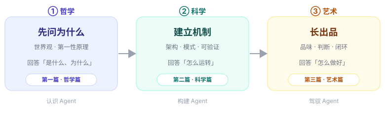
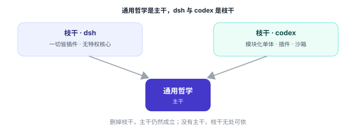
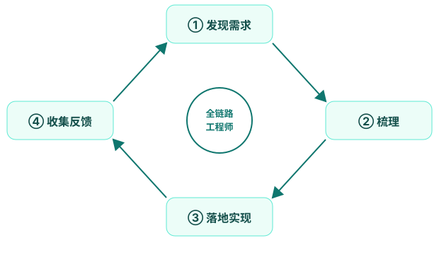
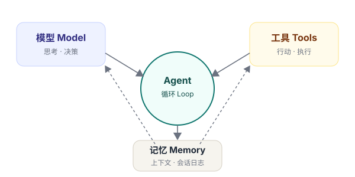

# 全书概览

> 写给即将成为「全链路 Agent 工程师」的你

这是一个软件正在学会**行动**的时代。大语言模型不再只是生成文字，它们开始调用工具、读写文件、执行命令、委派子任务、反思并修正自己。我们把这种「能感知、能决策、能行动、有记忆」的软件实体，称为 **Agent（智能体）**。

## 这本书想做什么

市面上的 Agent 教程大多教你「怎么调某个 API」或「怎么用某个框架」。这本书想做一件更根本的事：**帮你建立 Agent 工程的心智模型**——不仅能看懂一个框架，更能判断一个设计为什么好，进而自己做出好的 Agent。

为此，我们选了**两个真实、自洽的开源 Agent**——DeepSeek Harness 与 Codex——作为贯穿全书的**双标本**，并沿着一条朴素的发展规律来组织全书：

**图 0-1** 事物的发展方向：哲学 → 科学 → 艺术。学习 Agent 亦然。

> **三个词，记住这本书**：哲学回答「是什么、为什么」，科学回答「怎么运转」，艺术回答「怎么做好」。三篇环环相扣：没有哲学，机制是盲目的；没有科学，品味是空谈；没有艺术，工程没有灵魂。

## 主干与枝干：这本书的骨架

贯穿全书的，是一条**主干**——**Agent 的通用哲学**：心智模型、上下文纪律、行动边界、可组合性、记忆分层、人机分工、可观测、评估、自举。这些规律不依附于任何具体框架，是**所有 Agent 都逃不掉的规律**。

在这条主干上，长出了**两根枝干**——两个真实标本的设计哲学，是同一规律在不同取舍下的**两种思考方向**：

**图 0-2** 通用哲学是主干，dsh 与 codex 是枝干——删掉枝干，主干仍然成立；没有主干，枝干无处可依。

- **DeepSeek Harness（dsh）**——把「可组合」推向极致：**一切皆插件**、无特权核心、事件驱动、能力接缝。它是最纯粹的架构科学标本。
- **Codex（codex）**——把「严谨」推向极致：生产级工程化，模块化单体 + 插件系统 + 沙箱 + 服务端。它是最务实的工程标本。

> **一根主干，两根枝干**：读这本书时记住这个比喻——通用规律是主干（必须掌握），两个标本是枝干（用来对照）。什么时候用哪个标本？看哪个能把这条规律讲得更清楚——dsh 擅长的以 dsh 为主，codex 擅长的以 codex 为主；规律不成立的地方，就不硬上双标本。

## 两条线：应用线与创造线

在这条主线上，还并排织着**两条线**：一条**应用线**——先学会把 Agent 用好（好的厨子首先是老吃家）；一条**创造线**——再学会把 Agent 造出来。两条线有边界、不设墙，**在用中做，在做中用**：第 1、2 章是共用地基，第 3、4 章讲使用，第 5 章讲构建，第 6 章把两条线拧成一条链，此后三篇一路并排到终章。

## 一个新身份：全链路工程师

AI 时代正在消融旧的角色边界。产品经理、前端、测试、运维……这些曾经的分工，正在被一个更完整的角色覆盖：**一个人，从发现需求到梳理需求，到落地实现，再到收集反馈、持续迭代，独立完成整个闭环**。

**图 0-3** 全链路工程师的闭环：发现 → 梳理 → 落地 → 反馈，周而复始。

这就是这本书的终点：不是把你变成「会调框架的人」，而是把你变成**能闭环的人**。

**图 0-4** 贯穿全书的 Agent 心智模型：模型（思考）+ 记忆（上下文）+ 工具（行动），由循环（Loop）驱动。

## 怎么读这本书

1. **系统通读**——顺着三篇走一遍，建立完整体系。适合把它当作一门课来学。
2. **边读边做**——每章末尾都有「动手做」。理论落地，才是真的学会。
3. **按需查阅**——把它当作案头工作台，遇到问题回来翻对应章节与附录。

每章的结构保持一致，降低你的阅读成本：

- **导语**——本章要解决什么问题，一句话说清。
- **正文**——用图、表、代码、类比，把概念讲透。
- **一张图**——把本章内容收拢成一张可回看的结构图。
- **要点回顾**——三到五条，方便复盘。
- **动手做**——一个小练习，把知识变成肌肉记忆。

## 关于本书的编写

这本书的写作方式，本身就是它所主张工作方式的一次演示：**由人定方向、提要求、做判断，由 AI Agent 协作产出，再逐步迭代打磨**。你现在读到的全书概览，就是第一轮骨架——欢迎你随时调整，我们再一步步把每一章「填肉」。

> **开始之前**：你不需要先精通任何框架，也不需要会写某个特定语言的代码。你只需要：好奇心、一点编程基础，以及**愿意把「为什么」问到根上**的耐心。

那么，让我们从第一篇——**哲学篇**开始。
